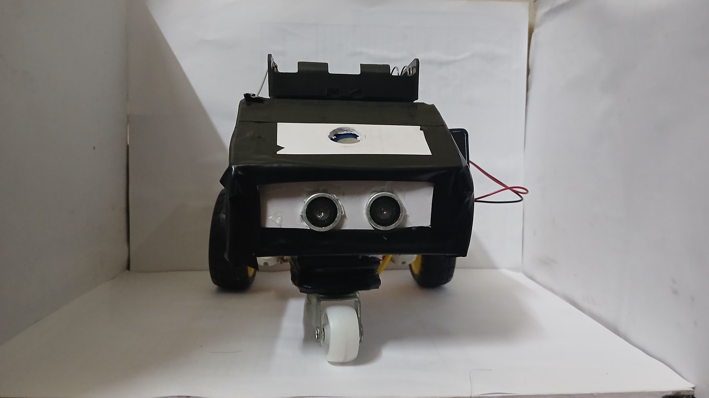

# MazeTracer V0

MazeTracer V0 is an Arduino-based maze-solving robot developed during a competition. The robot uses three ultrasonic sensors and a left-hand rule algorithm to navigate unknown mazes while displaying its current actions on an OLED display.

## 📸 Model

## 🚀 Features

* Left-hand rule maze-solving algorithm
* Three ultrasonic sensors for obstacle detection
* OLED status display
* Capacitive touch button start mechanism
* Autonomous decision making
* Automatic maze completion detection

## 🛠 Hardware Used

* Arduino Uno
* 3 × HC-SR04 Ultrasonic Sensors
* SSD1306 OLED Display
* L298N Motor Driver
* 2 × DC Motors
* Capacitive Touch Button
* Tank-style chassis

## 📚 Software & Libraries Used

### Arduino

* PlatformIO
* NewPing: https://docs.arduino.cc/libraries/newping/
* Adafruit GFX: https://github.com/adafruit/Adafruit-GFX-Library
* Adafruit SSD1306: https://github.com/adafruit/Adafruit_SSD1306

## 🏗️ Build Instructions

* Clone the repository and open the project in PlatformIO.
* Install the required libraries.
* Connect the hardware as shown in the images.
* Upload the code to the Arduino.

## 📂 Code

All source code is available inside the `src` folder.

The robot uses a simple left-hand rule algorithm for navigation and continuously monitors its surroundings using ultrasonic sensors.

## 📖 Code Modules

* **forward()** – Moves the robot forward
* **turnleft()** – Performs a left turn
* **turnright()** – Performs a right turn
* **backward()** – Handles dead ends
* **leftdistance()** – Reads the left ultrasonic sensor
* **centerdistance()** – Reads the center ultrasonic sensor
* **rightdistance()** – Reads the right ultrasonic sensor
* **solve()** – Main maze-solving logic

## 🖥️ OLED Display

The OLED display provides real-time status updates, including:

* Maze Solver startup screen
* Entering Maze
* Moving Forward
* Turning Left
* Turning Right
* Turning Back
* Maze Solved

## 📸 Demo

Photos of the original prototype are available in the `Images` folder.

The original hardware has since been dismantled, so videos of the system are not available.

## 🔮 Future Improvements

* Implement coordinate tracking
* Add path memory and replay functionality
* Upgrade to Flood Fill or Boundary Fill algorithms
* Improve turning accuracy using encoders
* Design a custom chassis

## 👤 Author

Developed by Supreeth (Competition Project, 2025).
=======
# MazeTracer

MazeTracer is a tank-style Arduino-based maze-solving robot using three ultrasonic sensors, an OLED display, and a **left-hand rule** algorithm. 
It records visited coordinates and **displays the solved path**.

## 🚀 Features
- Left-hand rule maze solving
- OLED path visualization
- Coordinate logging
- Touch button start
- Display final solved path on an OLED display

## 🛠 Hardware Used
- Arduino Uno/Nano
- 3x Ultrasonic Sensors (HC-SR04)
- OLED Display (SSD1306)
- Motor Driver (L298N) + 2 DC Motors
- Capacitive Touch Button
- Power source (2 * 18650 cells , 1 * 9V Battery)
- Tank Style Chassis

## 📚 Libraries Used
- NewPing : https://docs.arduino.cc/libraries/newping/
- Adafruit GFX : https://github.com/adafruit/Adafruit-GFX-Library
- Adafruit BusIO : https://github.com/adafruit/Adafruit_BusIO
- Adafruit SSD306 : https://github.com/adafruit/Adafruit_SSD1306
- Custom Motor Library **(Files Included)**

## 🏗️ Build Instructions
- Clone the repo and open in PlatformIO IDE.
- Ensure `platformio.ini` is configured for your board (ESP32/Arduino Uno, etc.).
- Build and upload with one click!

## 📂 Code
All Arduino code is available in the `src/` folder.  
To run:  
1. Install the libraries.  
2. Upload the code to Arduino.  
3. Connect the sensors, display, and motors as per the circuit diagram **(Present inside Images Folder)**.

## 📖 Code Modules
- **Sensor.h / Sensor.cpp** – handles ultrasonic input
- **Motor.h / Motor.cpp** – motor control
- **Display.h / Display.cpp** – OLED display logic
- **Solver.h / Solver.cpp** – pathfinding and tracking

## 📸 Demo
Photos are present inside the images folder 

## 🔮 Future Improvements 
- Smarter pathfinding (Boundary Fill/Flood Fill).  
- Implement Bluetooth/Wifi logging to a mobile app.  
- 3D print a custom chassis for better stability.
- Make a menu driven OLED screen which lets you choose mode of solving

## 👤 Author
Developed by Supreeth (12th grade project, 2025).  
>>>>>>> ed32019ce063f0cf1679a702ad61ca55410ff01b
